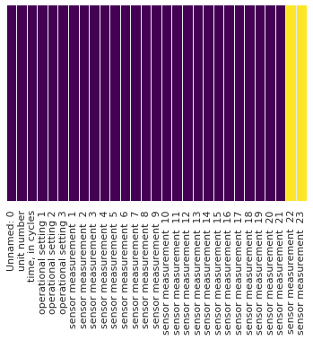
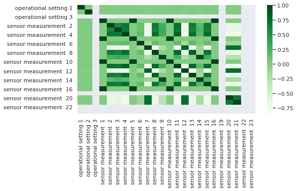
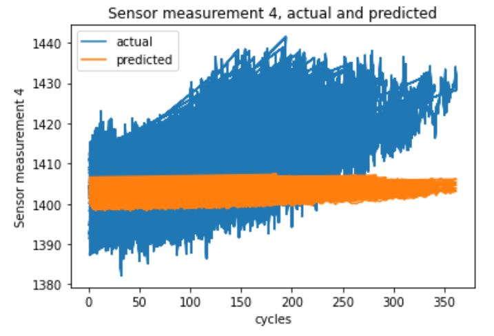

# Forecasting models based on time-series data
When procuring or maintaining machinery, it is useful to know how much life is left on the component parts or on the composite system.
On some machinery, it is not a reasonable option to allow the machine to go past the time when a preventive maintenance is needed. 
Dangerous accidents and costly damage have resulted when such a mistake was made.
Yet maintenace costs can be very expensive.
Thus, cost can be reduced by not having the maintenance done too early, while also ensuring that the maintenance is done before it is too late.

The CMAPSS engine aircraft dataset from NASA was used to demonstrate a method for estimating remaining useful life.

A dataframe was created by reading the 4 training csv files and appending each, in python.

100 units were subjected to this modeling.
When a certain threshold on the sensor measurements was reached, it was inferred that the units had departed from optimal operational windows. Then the model was halted.

Shown below are the details of the dataframe containing the dataset.

class 'pandas.core.frame.DataFrame'>
103150 entries, 0 to 20629
Data columns (total 28 columns):
|column index  | description |             |        |
|--------------|-------------|-------------|--------|
| 0            | unit        | number      |        |
| 1            | time,       | in          | cycles |
| 2            | operational | setting     | 1      |
| 3            | operational | setting     | 2      |
| 4            | operational | setting     | 3      |
| 5            | sensor      | measurement | 1      |
| 6            | sensor      | measurement | 2      |
| 7            | sensor      | measurement | 3      |
| 8            | sensor      | measurement | 4      |
| 9            | sensor      | measurement | 5      |
| 10           | sensor      | measurement | 6      |
| 11           | sensor      | measurement | 7      |
| 12           | sensor      | measurement | 8      |
| 13           | sensor      | measurement | 9      |
| 14           | sensor      | measurement | 10     |
| 15           | sensor      | measurement | 11     |
| 16           | sensor      | measurement | 12     |
| 17           | sensor      | measurement | 13     |
| 18           | sensor      | measurement | 14     |
| 19           | sensor      | measurement | 15     |
| 20           | sensor      | measurement | 16     |
| 21           | sensor      | measurement | 17     |
| 22           | sensor      | measurement | 18     |
| 23           | sensor      | measurement | 19     |
| 24           | sensor      | measurement | 20     |
| 25           | sensor      | measurement | 21     |
| 26           | sensor      | measurement | 22     |
| 27           | sensor      | measurement | 23     |

As shown above, the first column was elapsed cycles in seconds.

The next 3 columns represented the varied operational settings

The last 23 columns represented the sensor measurements.
The following columns, upon closer examination were found to contain a single line or null values

| 26           | sensor      | measurement | 22     |
| 27           | sensor      | measurement | 23     |

A null check was performed. As shown there were no individual null values. Those only occured for the entire column, as described earlier.

https://github.com/CarveTheFuture/Forecasting/blob/main/Charts/Null_Check.png

A correlation matrix was charted as shown below:

https://github.com/CarveTheFuture/Forecasting/blob/main/Charts/Correlation_Plot.png

Sensors 1-4 raw data are plotted

https://github.com/CarveTheFuture/Forecasting/blob/main/Charts/Sensors%201-4.png

Stationarity was checked on the sensor measurements using the Johansen Cointegration test.
The eigenvalue algorithm did not converge.
This is not surprising since the time values have long-term trends in the mean

One level of time differencing was executed in order to attain stationarity.
This time the kpss test was used. 

I ran the kpss test after one level of differencing and got a kpss statistic of 0.00077 and a p=value of
 0.1, Also, the plotted data (after differencing) appears stationary and yields low errors upon running the ARIMA model.
I ran an ARIMA model on sensor measurement 2 and obtained good p-values for each coefficient.
I then tried to use the operational settings as exogenous variables. For sensor 3, the model complained that it was a constant. 
So I removed it. For sensor 1, the p-value was .089 and for sensor 2 the p-value was 0.011.

The next steps was to run the ARIMA modeling on all the sensor measurements.
Shown below are the results from two sensors.

                                ARIMA Model Results                                
===================================================================================
Dep. Variable:     D.sensor measurement  2   No. Observations:               103149

Model:                      ARIMA(5, 1, 0)   Log Likelihood              -39498.414

Method:                            css-mle   S.D. of innovations              0.355

                                                                                   
|                            |   | coef      | std err | z        | P>\|z\| | [0.025 | 0.975] |
|----------------------------|---|-----------|---------|----------|---------|--------|--------|
| const                      |   | -9.00E-06 | 0       | -0.024   | 0.981   | -0.001 | 0.001  |
| operational setting 1      |   | -0.6165   | 0.363   | -1.7     | 0.089   | -1.327 | 0.094  |
| operational setting 2      |   | 6.6987    | 2.628   | 2.549    | 0.011   | 1.548  | 11.849 |
| ar.L1.D.sensor measurement | 2 | -0.7144   | 0.003   | -230.629 | 0       | -0.72  | -0.708 |
| ar.L2.D.sensor measurement | 2 | -0.5085   | 0.004   | -135.592 | 0       | -0.516 | -0.501 |
| ar.L3.D.sensor measurement | 2 | -0.3457   | 0.004   | -88.051  | 0       | -0.353 | -0.338 |
| ar.L4.D.sensor measurement | 2 | -0.2224   | 0.004   | -59.302  | 0       | -0.23  | -0.215 |
| ar.L5.D.sensor measurement | 2 | -0.1025   | 0.003   | -33.077  | 0       | -0.109 | -0.096 |

                                                                        
|                                | ARIMA Model Results      |                     |             |         |          |        |   |
|--------------------------------|--------------------------|---------------------|-------------|---------|----------|--------|---|
|                                |                          |                     |             |         |          |        |   |
| Dep. Variable:                 | D2.sensor measurement  9 | No. Observations:   | 103148      |         |          |        |   |
| Model:                         | ARIMA(5, 2, 0)           | Log Likelihood      | -362710.719 |         |          |        |   |
| Method:                        | css-mle                  | S.D. of innovations | 8.145       |         |          |        |   |
|                                |                          |                     |             |         |          |        |   |
|                                | coef                     | std err             | z           | P>\|z\| | [0.025   | 0.975] |   |
|                                |                          |                     |             |         |          |        |   |
| const                          | 0.0004                   | 0.006               | 0.066       | 0.948   | -0.011   | 0.012  |   |
| operational setting 1          | 20.7952                  | 5.858               | 3.55        | 0       | 9.315    | 32.276 |   |
| operational setting 2          | -91.9411                 | 42.19               | -2.179      | 0.029   | -174.633 | -9.25  |   |
| ar.L1.D2.sensor measurement  9 | -1.1225                  | 0.003               | -367.376    | 0       | -1.129   | -1.117 |   |
| ar.L2.D2.sensor measurement  9 | -0.9606                  | 0.004               | -216.928    | 0       | -0.969   | -0.952 |   |
| ar.L3.D2.sensor measurement  9 | -0.7191                  | 0.005               | -148.199    | 0       | -0.729   | -0.71  |   |
| ar.L4.D2.sensor measurement  9 | -0.4481                  | 0.004               | -101.184    | 0       | -0.457   | -0.439 |   |
| ar.L5.D2.sensor measurement  9 | -0.1925                  | 0.003               | -62.994     | 0       | -0.198   | -0.186 |   |

Assessing and interpreting results
One of the intended activities was to understand the natural "clustering" of the end-points and relate that to the operational setttings
Also, intended was to perhaps add the unit number as an exogenous variable

In any case a prediction was developed by supplying the original input data.
The prediction was superimposed on the actual data. 

https://github.com/CarveTheFuture/Forecasting/blob/main/Charts/PredictedVersusActualResults.png

The match was not very good, and needs to be improved.

References
https://machinelearningmastery.com/arima-for-time-series-forecasting-with-python/  

 Predictive Maintenance For Enhanced Asset Operation  
https://www.intel.com/content/www/us/en/manufacturing/solutions/predictive-maintenance-and-asset-optimization.html

Predictive Maintenance Drives Smarter Fleet Management  
https://www.intel.com/content/www/us/en/internet-of-things/solution-briefs/predictive-maintenance-fleet-management-brief.html

NASA TurboFan dataset  
https://ti.arc.nasa.gov/tech/dash/groups/pcoe/prognostic-data-repository/#turbofan  

ARIMA grid search
https://machinelearningmastery.com/grid-search-arima-hyperparameters-with-python/  

ARIMA sample forecasts
https://machinelearningmastery.com/make-sample-forecasts-arima-python/  

ARIMA hyperparameter optimization
https://machinelearningmastery.com/arima-for-time-series-forecasting-with-python/  

